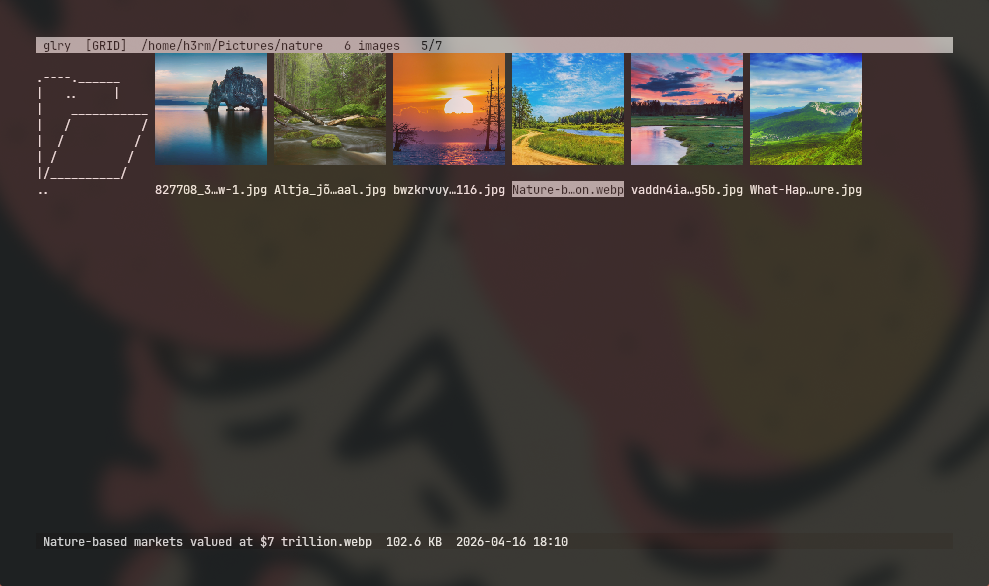
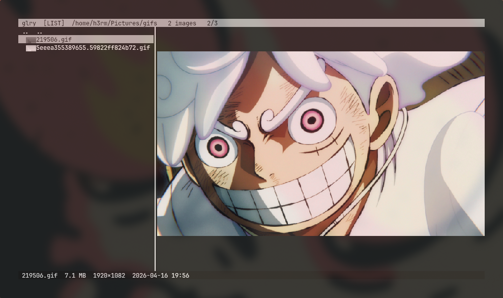
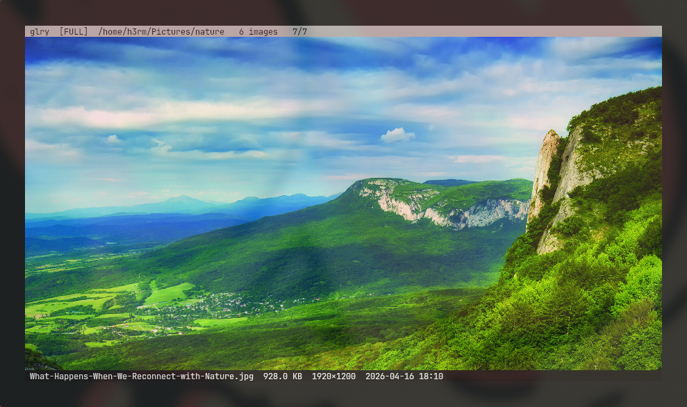

# glry

A terminal image gallery for browsing directory trees of images from a TUI,
with thumbnails rendered as real pixels directly in the terminal.

Built on [ratatui] and [ratatui-image], glry auto-detects your terminal's
graphics protocol (Kitty, iTerm2, or Sixel) and renders accordingly.

[ratatui]: https://github.com/ratatui-org/ratatui
[ratatui-image]: https://github.com/benjajaja/ratatui-image

## Screenshots

<table>
  <tr>
    <td align="center" width="50%">
      
      <br/>
      <sub><b>Grid view</b> — thumbnail mosaic across a directory tree</sub>
    </td>
    <td align="center" width="50%">
      
      <br/>
      <sub><b>List view</b> — compact listing with inline preview</sub>
    </td>
  </tr>
  <tr>
    <td colspan="2" align="center">
      
      <br/>
      <sub><b>Fullscreen viewer</b> — aspect-fill rendering with togglable chrome</sub>
    </td>
  </tr>
</table>

## Features

- **Grid and list views** with `Tab` to switch between them.
- **Fullscreen viewer** with stepping between images, aspect-fill mode, and
  togglable chrome.
- **Animated GIF playback** in the fullscreen viewer, honoring per-frame
  delays.
- **Vim-style navigation** (`hjkl`, `gg`, `G`, `q`) alongside arrow keys.
- **Directory traversal** via the `..` entry or `Backspace`.
- **EXIF-aware orientation** so rotated photos display correctly.
- **Persistent thumbnail cache** keyed by path, size, and mtime.
- **Parallel decoding** with rayon; the UI remains responsive while
  thumbnails load.
- **Clipboard integration** to copy the selected image.

## Requirements

- A recent Rust toolchain with support for edition 2024.
- A terminal with an inline-graphics protocol. Verified on Kitty, WezTerm,
  Ghostty, iTerm2, and Sixel-capable terminals.
- On Linux, clipboard support requires one of:
  - `wl-clipboard` (Wayland)
  - `xclip` (X11)

  macOS and Windows work without additional dependencies.

## Installation

Install from [crates.io](https://crates.io/crates/glry):

```sh
cargo install glry
```

Or from a local checkout:

```sh
cargo install --path .
```

Or run directly without installing:

```sh
cargo run --release -- /path/to/photos
```

## Usage

```sh
glry [PATH]
```

`PATH` defaults to the current working directory.

### Key bindings

| Key                      | Action                                 |
| ------------------------ | -------------------------------------- |
| `h` `j` `k` `l` / arrows | Move selection                         |
| `gg` / `Home`            | Jump to first entry                    |
| `G` / `End`              | Jump to last entry                     |
| `PgUp` / `PgDn`          | Page up / down                         |
| `Tab`                    | Toggle grid / list view                |
| `Enter`                  | Open image fullscreen, or enter dir    |
| `Backspace`              | Go to parent directory                 |
| `y`                      | Copy selected image to clipboard       |
| `Esc` / `q`              | Exit fullscreen, or quit               |
| `Ctrl-C`                 | Quit                                   |

In the fullscreen viewer:

- `h` / `l` (or arrow keys) step to the previous / next image.
- `b` toggles the header and status bars.
- `c` toggles fill mode, cropping the image to the terminal's aspect ratio
  so it fills the viewport edge-to-edge.
- `a` opens an AI describe overlay for the current image (requires config
  opt-in and the `SWIFTROUTER_API_KEY` env var — see *AI describe* below).

## Supported formats

JPEG, PNG, GIF, BMP, ICO, TIFF, WebP, AVIF, PNM/PBM/PGM/PPM, TGA, DDS,
FarbFeld, QOI, HDR, and EXR — anything decoded by the
[`image`](https://crates.io/crates/image) crate.

## Configuration

glry reads an optional config file from `~/.config/glry/config` (or the
platform-specific equivalent on macOS and Windows). On first run, glry
writes a commented template containing the default values; uncomment any
line to override it. Unknown keys and invalid values are reported on
`stderr` and skipped.

The format is one `key = value` pair per line, with `#` for comments.
Colors accept any ratatui color string: a named color (`black`, `red`,
`darkgray`, …), an 8-bit palette index (`0`–`255`), or a `#rrggbb` hex
code. Booleans are `true` or `false`.

```ini
# ~/.config/glry/config

# Colors
header_fg    = "black"
header_bg    = "cyan"
selection_fg = "black"
selection_bg = "cyan"
status_fg    = "gray"
status_bg    = "black"
directory_fg = "yellow"
error_fg     = "red"
loading_fg   = "darkgray"

# Center-crop grid thumbnails to the cell aspect so every cell is filled.
# Set to false to letterbox each image inside its cell.
thumbnail_crop = true

# Hide the header and status bars when opening the fullscreen viewer.
# The `b` key always toggles them; this just sets the initial state.
fullscreen_hide_bars = false

# AI "describe this image" (press `a` in fullscreen). Requires the
# SWIFTROUTER_API_KEY environment variable. The endpoint must speak the
# OpenAI chat-completions shape (SwiftRouter is the default).
ai_enabled  = false
ai_base_url = "https://api.swiftrouter.com/v1"
ai_model    = "gpt-5.4-mini"
```

## AI describe

When `ai_enabled = true` *and* the `SWIFTROUTER_API_KEY` environment
variable is set, pressing `a` in the fullscreen viewer posts the current
image to an OpenAI-compatible chat-completions endpoint and shows the
assistant's reply in a centered overlay. Esc or `a` again closes it.

The default endpoint is [SwiftRouter](https://swiftrouter.com); any
vision-capable, OpenAI-compatible gateway works — override `ai_base_url`
and `ai_model`. The image is downscaled to 1024 px on the longest side
and uploaded as a base64 PNG data URL.

The feature is off by default so glry's baseline does not talk to the
network.

## Cache

Decoded thumbnails are written to `~/.cache/glry/` (or the platform
equivalent) as raw RGBA files, each named by a 64-bit xxh3 hash of
`(path, size, mtime, crop-variant)`. The cache is safe to delete at any
time; glry regenerates entries on demand. Changing `thumbnail_crop`
produces a distinct cache entry, so previously cached shapes are never
reused incorrectly.

## License

[MIT](LICENSE)
